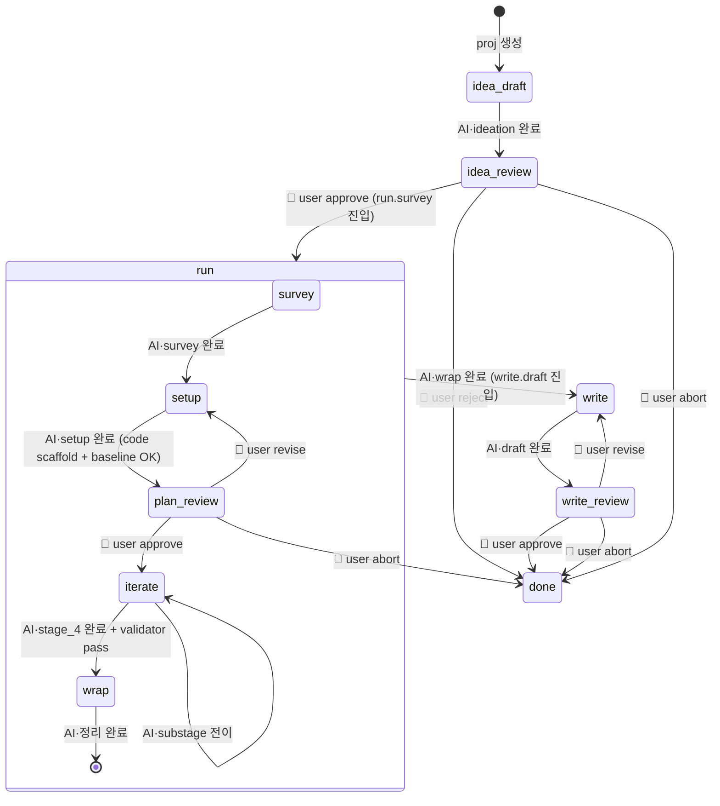

# Orchestrator State Machine — v0.2

> **Status:** v0.2 (2026-04-17 restructure). [`card-schema.md`](card-schema.md)의 stage/substage enum을 기반으로 연구 루프의 상태 전이를 정의한다.
>
> **v0.2 핵심 변경 (vs v0.1):**
> - Top-level stage를 **4개**로 축소: `idea`, `run`, `write`, `done`.
> - 기존 `planning`·`running`·`analysis`를 `run` 안의 substage로 흡수.
> - Run substage: `survey → setup → iterate → wrap` (researcher-centric).
> - `needs_attention`을 top-level stage에서 제거. `status=blocked` flag로 수렴 — 어느 substage에서든 튈 수 있음.
> - `plan_review` gate 위치: `run.setup → run.iterate` (코드 스캐폴드 + baseline 돌아가는 상태에서 승인).
> - `idea_review` / `final_review` 는 stage 자체가 아니라 **gate substage**로 표현.
>
> **Scope:** 이 파일은 **Research Kanban** (`projects/<slug>/card.md`)의 상태 전이. 자유탐색은 Kanban 바깥 별도 객체로 분리 — [`explore-schema.md`](explore-schema.md) 참조.

## 1. 개요

`auto-research`의 연구 루프는 **4 top-level stage + stage 내부 substage**의 유한 상태 머신이다. 단일 오케스트레이터가 `projects/<slug>/card.md`를 읽어 현재 state를 파악하고, 허용된 전이만 수행한다. 사용자는 웹앱 승인 액션(= `Command Queue` append)을 통해 gate 전이를 트리거한다.

## 2. Top-level stages

| stage | 의미 | 내부 substage |
|---|---|---|
| `idea` | 아이디어 등록·novelty check·승인 대기 | `draft` → `review` (gate) |
| `run` | 연구 수행 전체 (lit review부터 결과 정리까지) | `survey` → `setup` → `iterate` → `wrap` |
| `write` | 논문/보고서 작성 및 최종 승인 | `draft` → `review` (gate) |
| `done` | 완료·폐기·중단 (terminal) | — |

`stage` × `substage` 는 항상 valid 조합이어야 한다 (§3 표).

## 3. 유효 (stage, substage) 조합

| stage | substage | gate? | 주 작업 |
|---|---|:-:|---|
| `idea` | `draft` | | ideation, novelty check |
| `idea` | `review` | 🛑 | 사용자 승인 대기 |
| `run` | `survey` | | 관련 리서치 총조사, 깊이 있는 literature review |
| `run` | `setup` | | 실험 가능한 데이터셋 확보, 스캐폴드 코드, baseline 돌리기 |
| `run` | `plan_review` | 🛑 | 설정된 실험 설계·예산·성공기준 승인 대기 |
| `run` | `iterate` | | 가설 설정 및 실험 반복 (4-stage tree search 포함) |
| `run` | `wrap` | | 실험결과 정리, validator 재계산, 요약 작성 |
| `write` | `draft` | | LaTeX 초안, figure 생성 |
| `write` | `review` | 🛑 | 최종 산출물 승인 대기 |
| `done` | `null` | | terminal |

> **Note.** gate substage (`idea.review`, `run.plan_review`, `write.review`) 는 stage 전이가 아닌 **substage 전이**로 표현된다. Gate 통과 시 다음 substage (또는 다음 stage) 로 이동.

## 4. State Diagram



## 5. `status` flag

`status` 는 `stage`·`substage` 와 **독립적**으로, 지금 누구 차례인지·막혀있는지를 표현한다.

| status | 의미 |
|---|---|
| `running` | AI 워커가 작업 중 |
| `awaiting_user` | 사용자 액션 대기 (gate substage 이거나 blocker 해결 필요) |
| `blocked` | AI가 막혔을 때 — 어느 substage에서든 발생 가능. Blockers 섹션에 구체 질문 필수. 사용자 `resolve` 시 해제 |
| `idle` | 아직 pick 안 됨 |
| `done` | 완료 |
| `error` | 복구 불가 오류 |

**전이 규칙:**
- gate substage 진입 → `status=awaiting_user`, `assignee=user`.
- AI 재개 → `status=running`, `assignee=ai`.
- AI가 모호함/오류 직면 → `status=blocked`, `assignee=user`, Blockers에 구체적 질문 추가. **stage/substage 는 유지** (v0.1처럼 `needs_attention` stage로 이동하지 않음 — 현재 어느 substage에서 막혔는지 보존).
- 사용자 `resolve: <지시>` → `status=running`, `assignee=ai`. substage 그대로 재개.

## 6. Run substage 세부

### 6.0 Ideation: 두 경로

`stage=idea, substage=draft` 카드는 두 경로로 생성될 수 있다 (세 번째 경로로 Explore 승격이 있으나, Research Kanban 관점에선 `idea.draft` 카드가 이미 존재하는 상태로 등장):

| 경로 | trigger | assignee (대화 중) | 산출물 |
|---|---|---|---|
| **AI-autonomous** | orchestrator poll 또는 `/loop` | AI 주도 | `projects/<slug>/card.md` (`idea/draft`) 자동 생성 |
| **User-led chat** | 웹앱 `🗣 Ideate` 버튼 → 우측 IdeationPanel | 양방향 대화 | 사용자가 `✦ Crystallize` 누르면 카드 생성 |
| **Explore promotion** | Explore finding/direction 승격 ([explore-schema.md](explore-schema.md)) | AI crystallize | 사용자가 승격 시 slug 확정 → 카드 생성 |

**User-led chat 프로토콜:**

1. 웹앱이 `research-worker` tmux 에 `@ideation-mode start` 전송. 워커는 ideation bias 파일 (`docs/private/research-direction.md` if present, else `docs/research-direction.example.md` template) + 기존 `idea/draft` 카드 로드 후 대화 대기.
2. 사용자 ↔ 워커 자유 대화 (pane 에서 직접). 파일 쓰기 금지.
3. 사용자 `✦ Crystallize to card` 클릭 → 웹앱이 slug 입력받아 `@crystallize slug=<slug>` 전송.
4. 워커가 대화 요약으로 `projects/<slug>/card.md` 생성 (`stage=idea, substage=draft, status=running, assignee=ai`).
5. `CardWatcher` SSE `card_added` → 웹앱 자동 반영. 이후 AI autonomous 경로와 동일하게 `idea/review` 게이트 진입 가능.

**`@ideation-mode end`** 전송 시 워커는 대화 모드 종료, 일반 inbox 처리 사이클 복귀.

### 6.1 `run.survey`
- **목표:** 관련 논문·선행 연구 총조사. Semantic Scholar / arXiv 기반.
- **산출물:** `projects/<slug>/docs/survey.md` (or `related_work.md`).
- **exit criterion:** 최소 N개 관련 논문 요약 + gap/novelty 재확인. AI 자체 판단으로 `setup` 진입.

### 6.2 `run.setup`
- **목표:** 실험 가능한 데이터셋 확보, 스캐폴드 코드 작성, baseline 훈련 sanity check.
- **산출물:** `projects/<slug>/docs/plan.md` (실험 설계 + 예산 + 성공 기준), `projects/<slug>/src/` 코드, `projects/<slug>/runs/baseline/` 결과.
- **exit criterion:** plan 4-item checklist 통과 + baseline 재현 가능. → `plan_review` gate 진입.

### 6.3 `run.plan_review` (🛑 gate)
- AI가 이 gate에 도착하면 `status=awaiting_user`. 사용자는 `projects/<slug>/docs/plan.md` + baseline 결과 검토 후:
  - `approve` → `run.iterate`
  - `revise: <피드백>` → `run.setup` (재작업)
  - `abort` → `done`
- **plan 4-item checklist 강제** (docs/methodology-review.md F2):
  1. benchmark choice + 적절성 근거
  2. train/val/test split + leakage check
  3. primary metric + claim과의 일치 근거
  4. **사전 commitment된** 성공 기준 (수치, iterate 시작 전에 fix)

### 6.4 `run.iterate`
- **목표:** 가설 설정 및 실험 반복. 내부적으로 `prelim → hp → agenda → ablation` 4-stage 로 세분.
- **내부 mini-state (optional, `substage_detail` 필드):** `prelim → hp → agenda → ablation`.
- **exit criterion:** stage_4_ablation 완료 + **validator pass**. validator가 `projects/<slug>/runs/<latest>/` raw 출력에서 모든 메트릭 재계산 → 보고치와 diff. mismatch 0개일 때만 `wrap` 진입. mismatch 있으면 `status=blocked` + Blockers에 diff 리스트 추가.
- validator 는 [MLR-Bench 80% fabrication rate](../docs/methodology-review.md#f1) 에 대한 deterministic 방어선.

### 6.5 `run.wrap`
- **목표:** 실험결과 정리, 메트릭 테이블·플롯 생성, 결과 요약 작성.
- **산출물:** `projects/<slug>/results/`, `card.md` Metrics·Artifacts 섹션 갱신, 요약 `projects/<slug>/docs/results.md`.
- **exit criterion:** 요약 완성 → `write.draft` 진입 (stage 전이).

## 7. Gate 정의 (3개)

🛑 표시된 substage 는 사용자 입력 없이는 진행 불가. 오케스트레이터는 이 substage 진입 시:

1. `status = awaiting_user`
2. `assignee = user`
3. Event Log에 `[gate]` 이벤트 추가
4. 해당 proj의 추가 AI 작업 중단 (sub-agent spawn 금지)

| Gate substage | 판단 포인트 | 사용자 옵션 |
|---|---|---|
| `idea.review` | 이 아이디어에 시간·compute 투자할 가치가 있나? | `approve` / `reject` / `abort` |
| `run.plan_review` | 제안된 실험 설계·예산·성공기준이 타당한가? 코드 스캐폴드 + baseline 확인 후. | `approve` / `revise` / `abort` |
| `write.review` | 산출물이 배포할 품질인가? | `approve` / `revise` / `abort` |

> **가장 큰 compute 절감은 `run.plan_review`.** iterate 이전에 차단하여 대부분의 compute 비용을 막는다. 파이프라인 경제성의 결정 지점.

## 8. Transition Table

| From (stage/substage) | To | Trigger | Actor | 조건 |
|---|---|---|---|---|
| `idea/draft` | `idea/review` | ideation 종료 | ai | novelty score 기록 |
| `idea/review` | `run/survey` | `approve` | user | `assignee→ai`, `status→running` |
| `idea/review` | `done` | `reject` / `abort` | user | |
| `run/survey` | `run/setup` | AI·survey 완료 | ai | `docs/survey.md` 또는 `docs/related_work.md` 작성 |
| `run/setup` | `run/plan_review` | AI·plan + scaffold + baseline 완료 | ai | 4-item checklist + baseline 재현 |
| `run/plan_review` | `run/iterate` | `approve` | user | `assignee→ai`, `status→running` |
| `run/plan_review` | `run/setup` | `revise: <피드백>` | user | |
| `run/plan_review` | `done` | `abort` | user | |
| `run/iterate` | `run/iterate` | substage_detail 전이 | ai | Event Log `stageN` 완료 |
| `run/iterate` | `run/wrap` | stage_4 완료 + validator pass | ai | validator mismatch 0 |
| `run/iterate` | (self, status=blocked) | validator mismatch | ai | Blockers에 diff 추가 |
| any | (self, status=blocked) | AI 오류·모호 | ai | Blockers에 질문 |
| (self, status=blocked) | (self, status=running) | `resolve: <지시>` | user | 같은 substage 재개 |
| `run/wrap` | `write/draft` | AI·정리 완료 | ai | `results.md` 작성 + Metrics 갱신 |
| `write/draft` | `write/review` | AI·draft 완료 | ai | `projects/<slug>/paper/` 산출물 존재 |
| `write/review` | `done` | `approve` | user | |
| `write/review` | `write/draft` | `revise: <피드백>` | user | |
| `write/review` | `done` | `abort` | user | |
| any non-done | `done` | `abort` | user | 언제든 중단 |

## 9. 오케스트레이터 루프 (의사 코드)

```python
while True:
    for card_path in glob("projects/*/card.md"):
        card = parse(card_path)

        # 1. 사용자 커맨드 먼저 처리
        for cmd in card.command_queue.pending():
            result = apply_command(card, cmd)
            cmd.mark_done()
            card.event_log.append(event("command_processed", cmd))
            if result.next_state:
                card.stage, card.substage = result.next_state

        # 2. AI 차례인지 확인 (gate·blocked 는 사용자 차례)
        if card.status != "running" or card.assignee != "ai":
            save(card_path, card)
            continue

        # 3. sub-agent spawn — (stage, substage) 조합으로 worker 선택 (§10)
        result = spawn_subagent(
            role=dispatcher[(card.stage, card.substage)],
            proj_dir=proj_dir(card),
            card=card,
        )

        # 4. 결과 반영
        card.event_log.extend(result.events)
        if result.metrics:
            card.metrics.update(result.metrics)
        if result.next_state:
            card.stage, card.substage = result.next_state
        if result.gate:
            card.status = "awaiting_user"
            card.assignee = "user"
            card.event_log.append(event("gate", f"{card.stage}/{card.substage} 진입"))
        if result.blocked:
            card.status = "blocked"
            card.assignee = "user"
            card.blockers.append(result.blocked.question)

        save(card_path, card)

    time.sleep(POLL_INTERVAL)
```

## 10. Sub-agent 역할 매핑 (멀티-세션 worker)

v0.1과 동일한 3 worker 구조 유지. dispatcher 테이블만 (stage, substage) 기준으로 조회:

| Worker tmux session | 담당 (stage, substage) | 주요 task type |
|---|---|---|
| `agent-research-worker` | `(idea, draft)`, `(run, survey)`, `(run, setup)` | `ideation`, `novelty_check`, `literature_scan`, `plan_draft`, `scaffold_setup` |
| `agent-execution-worker` | `(run, iterate)`, `(run, wrap)` | `stage_1_prelim`, `stage_2_hp`, `stage_3_agenda`, `stage_4_ablation`, `validator`, `results_wrap` |
| `agent-writing-worker` | `(write, draft)` | `latex_draft`, `latex_revise`, `automated_review` |

Dispatch 방식 (orchestrator → worker inbox → tmux send-keys) 는 v0.1 §7과 동일.

**File-write 경계 (하드 룰):** worker는 `projects/<slug>/` 와 자기 자신의 `agents/<role>/{outbox,log}` 만 쓸 수 있다.

## 11. 동시성 (v0.2)

- **proj 간 병렬:** 서로 다른 proj 는 동시에 sub-agent 돌림.
- **proj 내 순차:** 한 proj 는 한 번에 하나의 sub-agent.

## 12. v0.2 미정

- `run.iterate` 내부 `substage_detail` 필드 추가 여부 (prelim/hp/agenda/ablation 노출)
- Command Queue 충돌 해결 (단일 사용자 전제)
- Gate 상태에서 사용자가 직접 card.md 편집한 경우 재파싱 처리
- Worker context bloat 자동 감지 (N task / pane line count 임계값 정책)

## 부록 A. v0.1 → v0.2 마이그레이션 매핑

| v0.1 | v0.2 |
|---|---|
| `stage=backlog` | `stage=idea, substage=draft` |
| `stage=idea_review` | `stage=idea, substage=review` |
| `stage=planning` | `stage=run, substage=setup` (플랜 작성은 setup에 흡수) |
| `stage=plan_review` | `stage=run, substage=plan_review` |
| `stage=running, substage=stage_1_prelim` | `stage=run, substage=iterate` (detail: prelim) |
| `stage=running, substage=stage_2_hp` | `stage=run, substage=iterate` (detail: hp) |
| `stage=running, substage=stage_3_agenda` | `stage=run, substage=iterate` (detail: agenda) |
| `stage=running, substage=stage_4_ablation` | `stage=run, substage=iterate` (detail: ablation) |
| `stage=needs_attention` | `status=blocked`, stage/substage 보존 |
| `stage=analysis` | `stage=run, substage=wrap` |
| `stage=final_review` | `stage=write, substage=review` |
| `stage=done` | `stage=done` |
